
 
  
image

   

  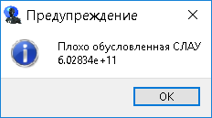

"spoiler"

spoiler

    

        <input class="carousel-open" type="radio" id="carousel-1" name="carousel" aria-hidden="true" hidden="" checked="checked">
        

            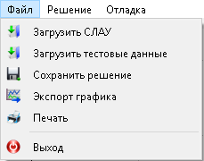
        

        <input class="carousel-open" type="radio" id="carousel-2" name="carousel" aria-hidden="true" hidden="">
        

            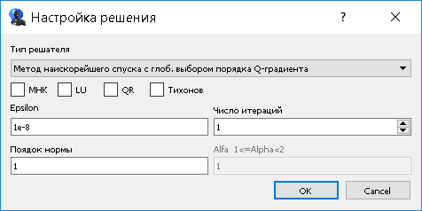
        

        <input class="carousel-open" type="radio" id="carousel-3" name="carousel" aria-hidden="true" hidden="">
        

            
        

        <label for="carousel-3" class="carousel-control prev control-1">‹</label>
        <label for="carousel-2" class="carousel-control next control-1">›</label>
        <label for="carousel-1" class="carousel-control prev control-2">‹</label>
        <label for="carousel-3" class="carousel-control next control-2">›</label>
        <label for="carousel-2" class="carousel-control prev control-3">‹</label>
        <label for="carousel-1" class="carousel-control next control-3">›</label>
        <ol class="carousel-indicators">
            <li>
                <label for="carousel-1" class="carousel-bullet">•</label>
            </li>
            <li>
                <label for="carousel-2" class="carousel-bullet">•</label>
            </li>
            <li>
                <label for="carousel-3" class="carousel-bullet">•</label>
            </li>
        </ol>
    

[Описание](#0)    
[Загрузка данных](#1)    
[Настройка решателя СЛАУ](#2)    
[Вывод результатов](#3)    
[Настройка графика](#4)    
[Сохранение результатов](#5)    
[Реализация под Android Qt QML](./slau-qml/slau_qml)    

### Описание
Программа написана в рамках дипломного поекта ,с использованием технологий Qt Widget ,QCustomPlot, MatLab, С++.
Реализованы следующие методы:
- Метод Гаусса
- Метод Якоби
- Метод Зейделя
- Метод Минимальных невязок
- Метод сопряженных градиентов
- Метод Q-регуляризации
- Метод наискорейшего спуска с глоб. выбором порядка Q-градиента ([описание метода](http://www.ivdon.ru/ru/magazine/archive/n3y2015/3150))
- Метод наискорейшего спуска с покоординатным выбором порядка Q-градиента ([описание метода](http://www.ivdon.ru/ru/magazine/archive/n3y2015/3150))
- Метод мин.невязок с глоб. выбором порядка Q-градиента ([описание метода](http://www.ivdon.ru/ru/magazine/archive/n3y2015/3150))
- Метод мин.невязок с покоординатным выбором порядка Q-градиента ([описание метода](http://www.ivdon.ru/ru/magazine/archive/n3y2015/3150))
- Matlab метод минимальных невязок ([взят из библиотеки МАТЛАБ](http://www.mathworks.com/help/matlab/ref/minres.html))
- Matlab метод квазиминимальных невязок ([взят из библиотеки МАТЛАБ](http://www.mathworks.com/help/matlab/ref/qmr.html))
- Matlab метод бисопряженных градиентов ([взят из библиотеки МАТЛАБ](http://www.mathworks.com/help/matlab/ref/bicg.html))
- МНК
- LU
- QR

_ _ _

Программа считывает данные из текстовых файлов (*.txt) которые подготавливает пользователь. Файл должен содержать СЛАУ в виде расширенной матрицы элементы которой разделены пробелами или табуляциями.

Создать новый текстовый документ matrix.txt и записать в него приведенную ниже СЛАУ в виде расширенной матрицы

  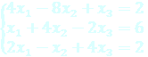

  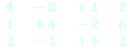

### Загрузка данных
Для загрузки СЛАУ в меню «Файл» выбрать пункт меню «Загрузить СЛАУ» и выбрать файл с данными.

  

Для построения графика готового решения выбрать пункт меню «Загрузить тестовые данные» и выбрать файл с результатами решения СЛАУ. После чего будет построен график.

### Настройка решателя СЛАУ 
После загрузки СЛАУ необходимо выбрать в меню «Решение» пункт меню «Решение СЛАУ»

  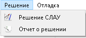

Откроется диалоговое окно настройки решателя.

  

В первом поле «Тип решателя» выбирается метод решения. Далее в группе checkBox-ов можно выбрать методы регуляризации. В зависимости от выбранного метода становятся доступны дополнительные поля настроек:
точность решения, число итераций, порядок Q-градиента, порядок Alfa. После нажатия кнопки «ок» начинается поиск решения.

### Вывод результатов 
Результаты выводятся в виде графика и текстовой информации (режим «Extended mode»).

  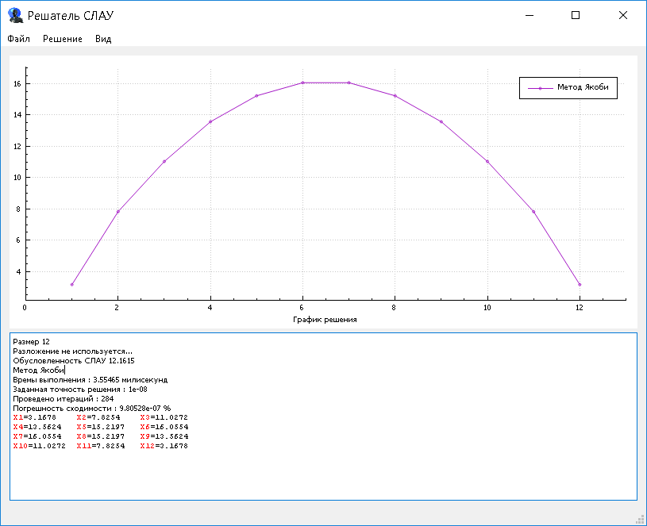

  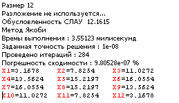

В процессе решения СЛАУ могут выводится информационные окна с
предупреждениями.
Предупреждение о плохой обусловленности СЛАУ.

  

В случае если решение не найдено за заданное количество итераций выводится информационное окно с предложением вывести результаты последней итерации.

  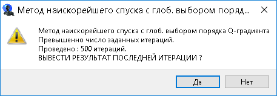

Если решение не найдено за 3 секунды выводится прогресс диалог с информацией об установленном и текущем количестве итераций, а также прогресс выполнения итераций в процентах.

  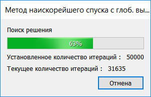

При невозможности решить СЛАУ выбранным методом выводятся соответствующие информационные окна.

  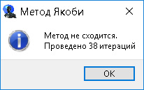
  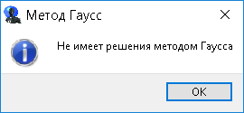
  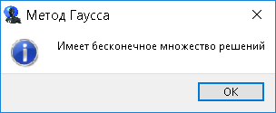

### Настройка графика 
На графике реализовано контекстное меню графика и легенды. Для вызова контекстного меню графика выбрать график на форме или легенде ЛКМ и вызвать меню ПКМ.

  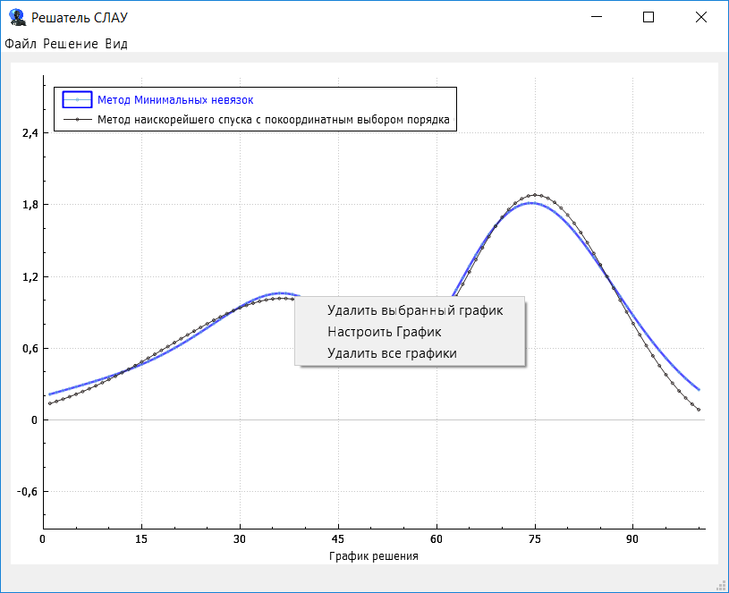

В меню графика имеется возможность удаления выбранного графика, удаление всех графиков, настройка графика. 
В меню легенды добавлены пункты перемещения легенды на форме по углам и центру. 

  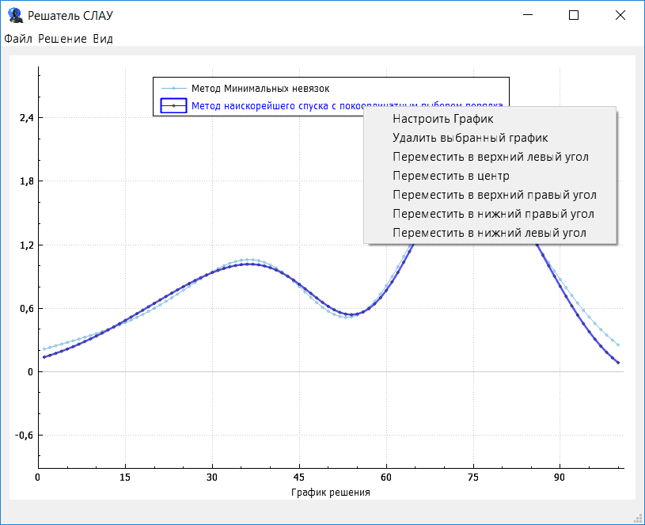

При выборе пункта меню «Настроить График» выводится форма настроек графика. На форме настроек можно изменить цвет, стиль, размер, точек и линии выбранного графика. 

  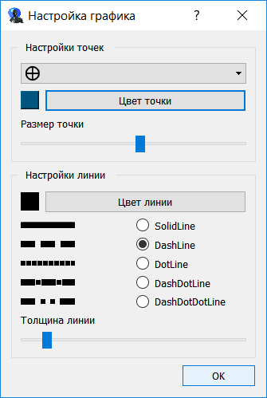

При изменении настроек происходит динамическое изменение графика.

  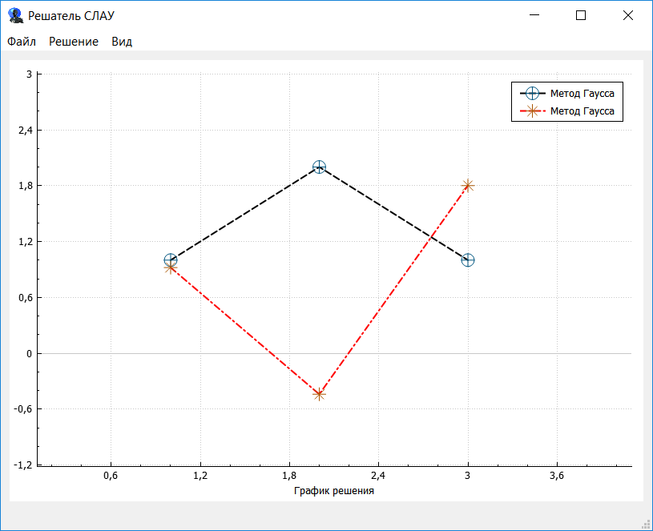

  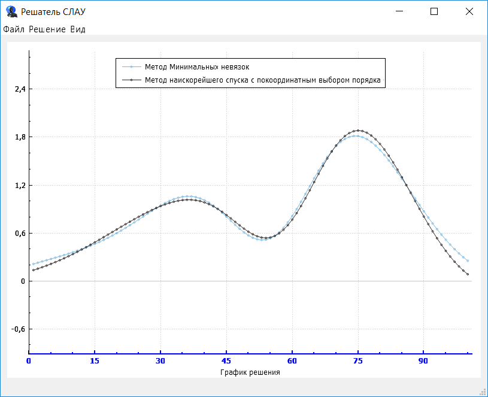

### Сохранение результатов

  

1. «Сохранить решение» - сохраняет в текстовый файл (*.txt) результаты решения СЛАУ и информацию о решаемой СЛАУ.

  

2. «Экспорт графика» - сохраняет график решения в *.jpg файл.

  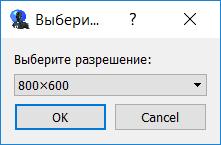

3. «Печать» - выводит окно с предварительным просмотром печати результатов.

  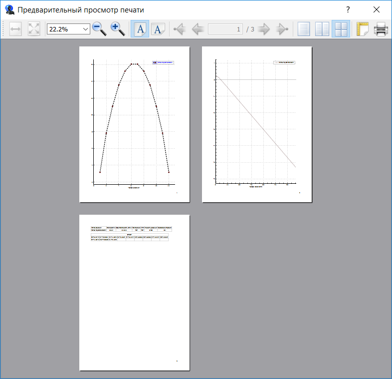

