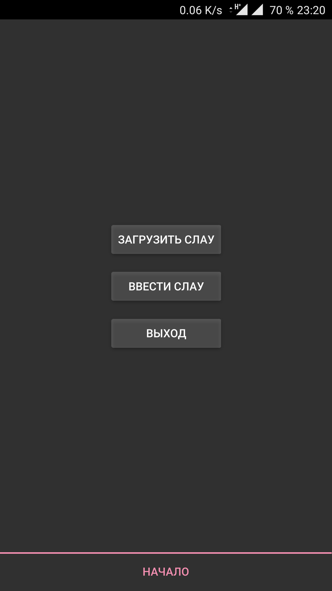
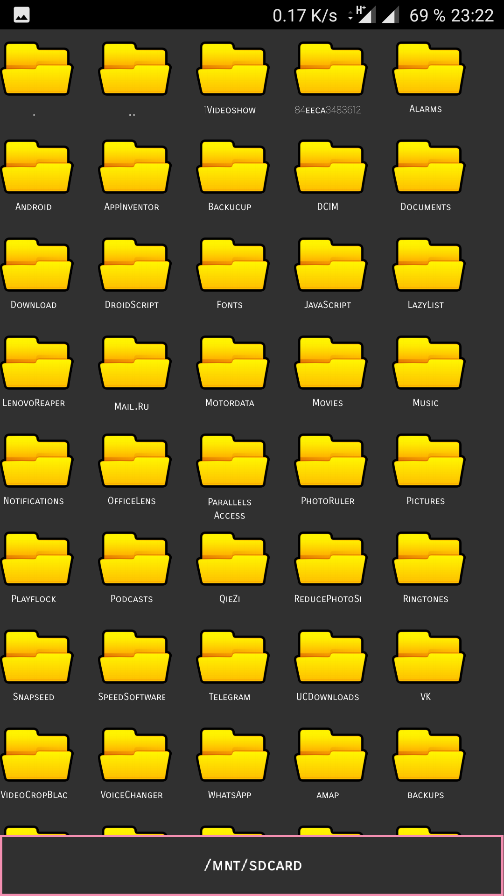
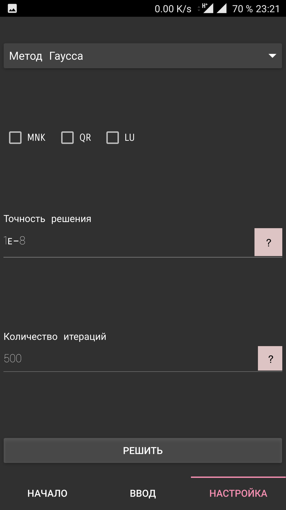
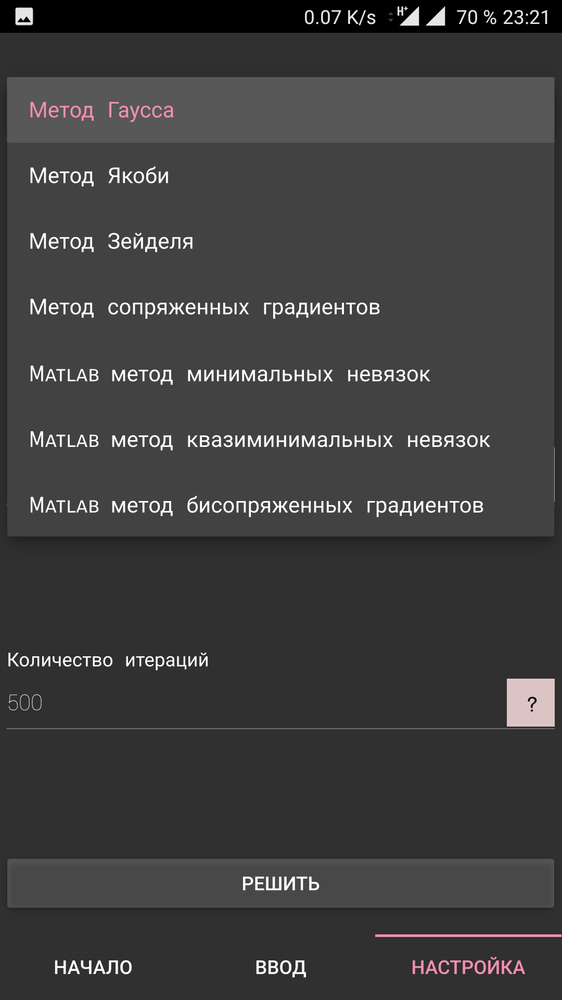
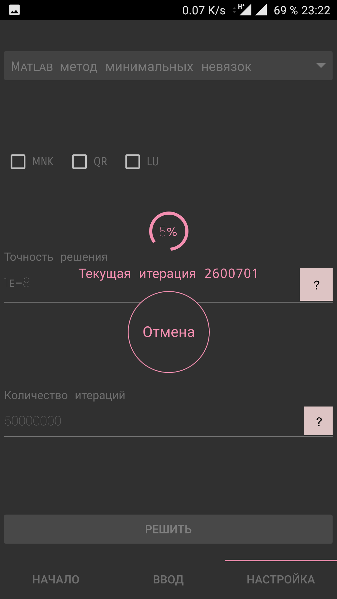
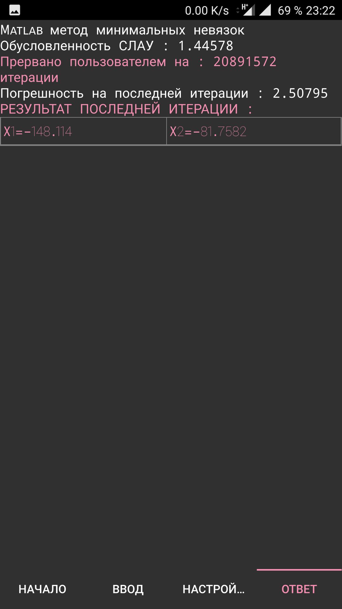
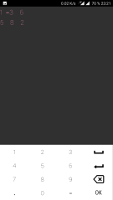
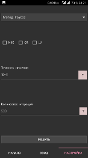

Использовалась библиотека  классов для решения СЛАУ из моего дипломного [проекта](../).По сути был реализован GUI на Qt Quick заточенный под Андроид.

    

        <input class="carousel-open" type="radio" id="carousel-1" name="carousel" aria-hidden="true" hidden="" checked="checked">
        

            <section class="wrapper">
    <section class="container-gallery small-list-block-1 medium-list-block-3 big-list-block-6">
      <li class="item-gallery" >
        
        
      </li>
    </section>
  </section>
        

        <input class="carousel-open" type="radio" id="carousel-2" name="carousel" aria-hidden="true" hidden="">
        

            
        

        <input class="carousel-open" type="radio" id="carousel-3" name="carousel" aria-hidden="true" hidden="">
        

            
        

		<input class="carousel-open" type="radio" id="carousel-4" name="carousel" aria-hidden="true" hidden="">
        

            
        

		<input class="carousel-open" type="radio" id="carousel-5" name="carousel" aria-hidden="true" hidden="">
        

            
        

		<input class="carousel-open" type="radio" id="carousel-6" name="carousel" aria-hidden="true" hidden="">
        

            
        

		<input class="carousel-open" type="radio" id="carousel-7" name="carousel" aria-hidden="true" hidden="">
        

            
        

        <label for="carousel-7" class="carousel-control prev control-1">‹</label>
        <label for="carousel-2" class="carousel-control next control-1">›</label>
        <label for="carousel-1" class="carousel-control prev control-2">‹</label>
        <label for="carousel-3" class="carousel-control next control-2">›</label>
        <label for="carousel-2" class="carousel-control prev control-3">‹</label>
        <label for="carousel-4" class="carousel-control next control-3">›</label>
		<label for="carousel-3" class="carousel-control prev control-4">‹</label>
        <label for="carousel-5" class="carousel-control next control-4">›</label>
		<label for="carousel-4" class="carousel-control prev control-5">‹</label>
        <label for="carousel-6" class="carousel-control next control-5">›</label>
		<label for="carousel-5" class="carousel-control prev control-6">‹</label>
        <label for="carousel-7" class="carousel-control next control-6">›</label>
		<label for="carousel-6" class="carousel-control prev control-7">‹</label>
        <label for="carousel-1" class="carousel-control next control-7">›</label>
        <ol class="carousel-indicators">
            <li>
                <label for="carousel-1" class="carousel-bullet">•</label>
            </li>
            <li>
                <label for="carousel-2" class="carousel-bullet">•</label>
            </li>
            <li>
                <label for="carousel-3" class="carousel-bullet">•</label>
            </li>
			<li>
                <label for="carousel-4" class="carousel-bullet">•</label>
            </li>
			<li>
                <label for="carousel-5" class="carousel-bullet">•</label>
            </li>
			<li>
                <label for="carousel-6" class="carousel-bullet">•</label>
            </li>
			<li>
                <label for="carousel-7" class="carousel-bullet">•</label>
            </li>
        </ol>
    

    
    
    
<section class="wrapper">
    <section class="container-gallery small-list-block-1 medium-list-block-3 big-list-block-6">
      <li class="item-gallery">
        
        <a href="#" class="lightbox ease-animate" id="img1">
          
          Hello!
        </a>
      </li>
        
      <li class="item-gallery">
        
        
      </li>
      
      <li class="item-gallery">
        
        <a href="#" class="lightbox fade-animate" id="img3">
          
          Bye Merry
        </a>
      </li>

      <li class="item-gallery">
        
        
      </li>

      <li class="item-gallery">
        
        
      </li>

      <li class="item-gallery">
        
        
      </li>

      <li class="item-gallery">
        
        
      </li>
    </section>
  </section>

